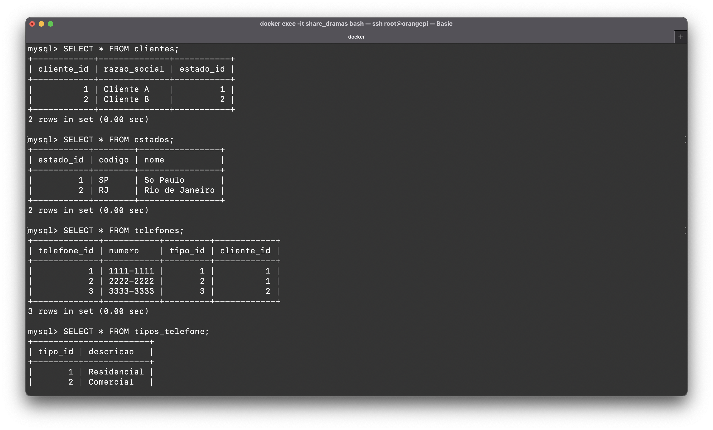

# Desafio - 4
Curiosidade: Para este desafio, utilizei o SGBD MySQL em execução dentro de um container Docker, que está rodando em um servidor Orange Pi, acessado remotamente por meio de uma conexão VPN.

